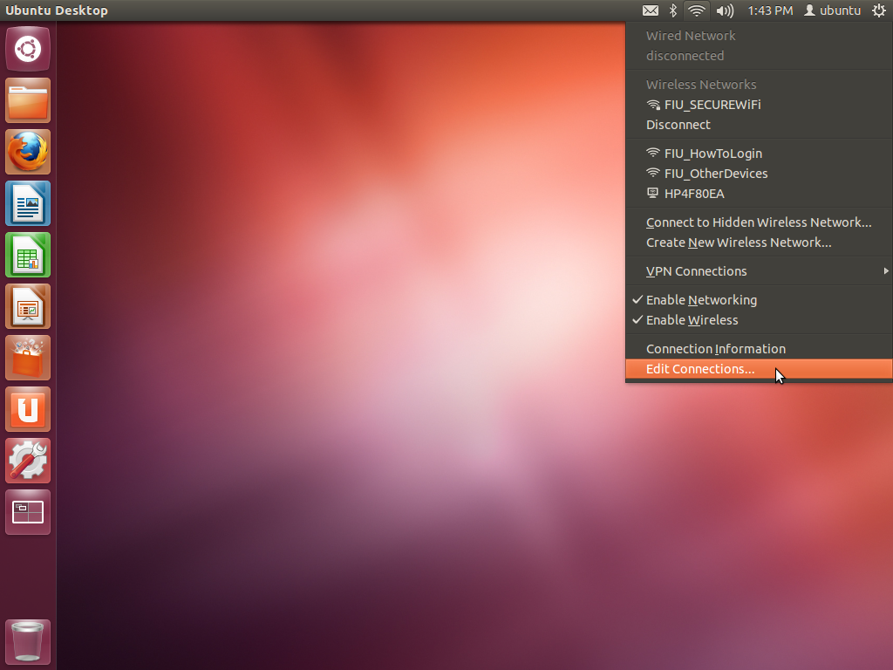

***Ubuntu* Laptop Internet Connection Setup:- sharing wired connection with
an UP²* board.***

To enable remote access to the UP²* XWindows GUI the following steps need
to be completed.

1: Connect Laptop Wi-Fi to an available Wi-Fi network.

2: Select the unused Wired Connection and enable internet sharing.

3: Plug in Ethernet Cable directly from Laptop to UP²* Board.

4: Determine the IP address given to the UP² board, using "**arp -a**"
command.

***Illustrated Instructions***

Select the **wifi/Ethernet** icon from the top menu, and choose **Edit
Connections...**

In the **Network Connections** dialog, highlight **Wired Connection 1,**
and click **Edit**

Select the **IPv4 Settings** tab and select the **Method** pulldown and
choose **Shared to other computers,** and click **Save**

Plug in an Ethernet Cable between the UP² upper Ethernet port and the
laptop. Open up a terminal and type "**arp -a**" to determine the IP
address of the enpxxxx port. In the screenshot below the wired Ethernet
IP address is 10.42.0.218, the others are Wi-Fi addresses and can be
safely ignored.

The 10.42.0.x IP address has been assigned to your UP² board.

***OpenCL driver upgrade for UP²* board installed with Intel® Distribution of OpenVINO™ toolkit R3.343***
1. SSH to UP² board with the IP address you just obtained, password: **upsquared**

        ssh upsquared@10.42.0.xxx
    
2. Go to the directory contains the OpenCL™ driver update script

        cd /opt/intel/computer_vision_sdk/install_dependencies/
        
3. Run the upgrade script

        sudo ./install_NEO_OCL_driver.sh
        
4. Once done, reboot UP²

        sudo reboot
        
    
